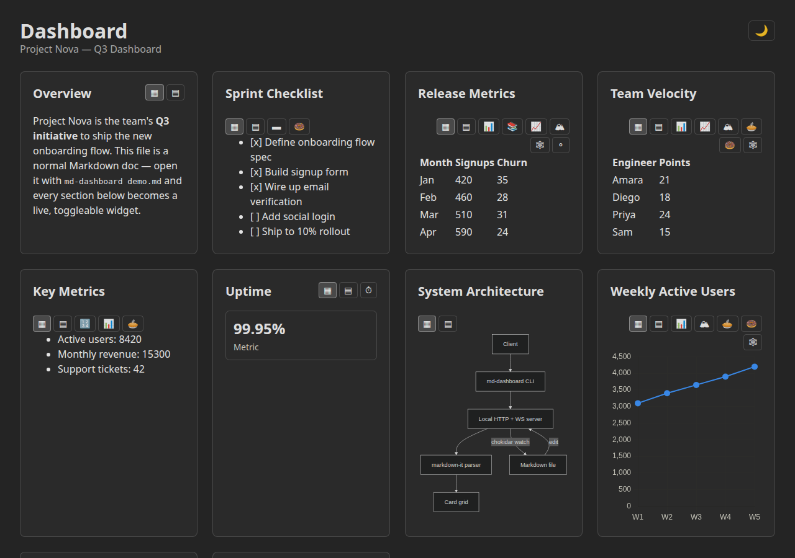
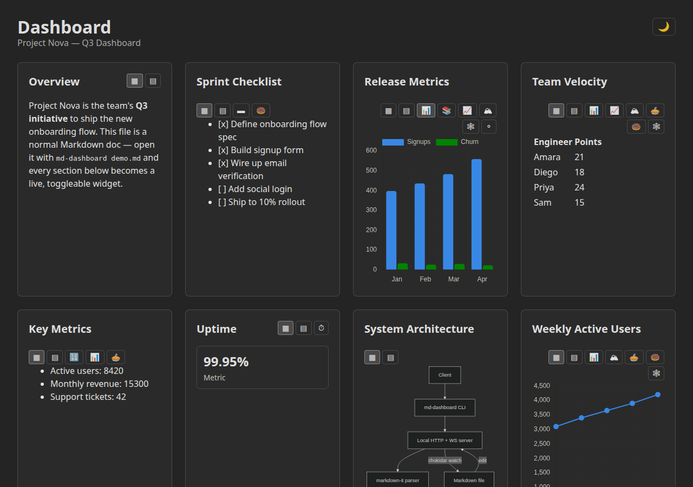
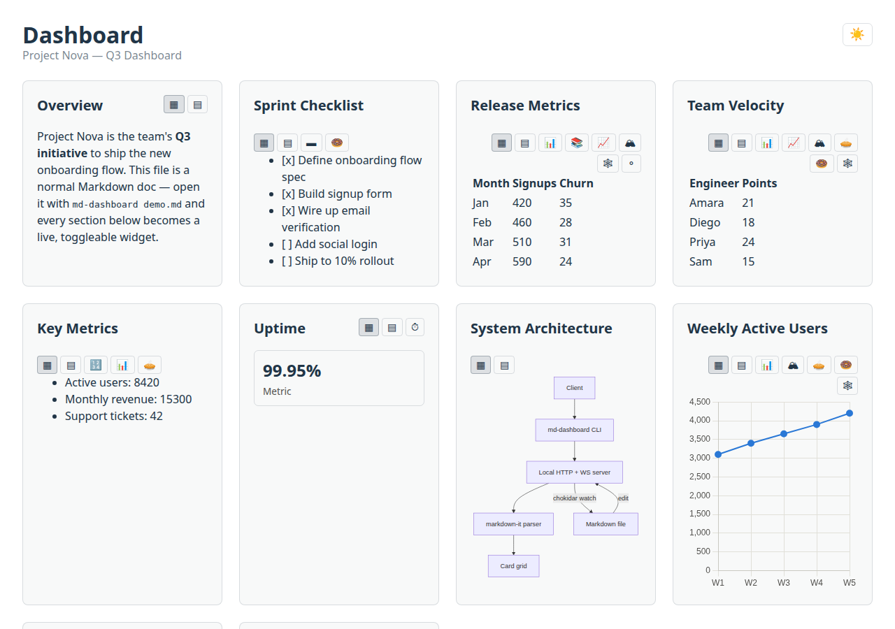

# md-dashboard

A CLI tool that turns a single Markdown file into a responsive, live-updating
web dashboard.

Run `md-dashboard <file.md>`, and every `##` section in that file becomes a
card in a responsive grid. Tables, task lists, numeric lists, and single
metrics render as data widgets that can be toggled at runtime between
equivalent chart types and a faithful "Markdown" raw-render mode. Edit the
file in your editor and the dashboard updates live over WebSocket in well
under a second — no manual reload, and each widget keeps whatever view you
toggled it to. The tool is **read-only** toward your content: it never writes
back to the Markdown file.



## Features

- **One Markdown file in, one dashboard out** — no config, no build step for
  your content. `##` headings become cards automatically.
- **Every Markdown element renders to a sensible default widget** — prose,
  headings, blockquotes, code blocks, images, horizontal rules, tables, task
  lists, numeric/key-value lists, single metrics, ` ```mermaid ` diagrams, and
  ` ```chart ` fences. See [`ELEMENTS.md`](ELEMENTS.md) for the full mapping.
- **Data widgets toggle between chart types** — a table can switch between
  Bar, Grouped/Stacked Bar, Line, Area, Pie, Donut, Radar, or Scatter
  (only the types valid for its actual shape), a task list between a
  checklist, progress bar, or donut, a numeric list between KPI tiles, Bar,
  or Pie, and a single metric between a stat tile and a gauge. Every widget
  also offers a faithful "Markdown" mode that renders the section as plain
  Markdown (`- [ ]` becomes a real checkbox, etc).
- **Live reload** — a `chokidar` watch pushes file changes over WebSocket;
  the dashboard re-renders in place, and each card's chosen view is
  preserved across the update and across a full page reload
  (`localStorage`).
- **Light and dark mode** — follows your OS `prefers-color-scheme` by
  default; a manual toggle overrides it and the choice persists.
- **Responsive** — the grid adapts from a single column on mobile up through
  a multi-column desktop layout.

## Quick start

This package isn't published yet, so run it straight from a clone. It ships
a demo fixture exercising every widget type —
[`examples/demo.md`](examples/demo.md):

```sh
git clone git@github.com:juliantrude/markdown-dashboard.git
cd markdown-dashboard
npm install
npm run build
node bin/md-dashboard.js examples/demo.md
```

This starts a local server, opens your browser to the dashboard, and watches
the file for changes. Press `Ctrl+C` to stop. Edit `examples/demo.md` while
the server is running and watch the dashboard update live.

| Toggled to a chart view | Light mode |
|---|---|
|  |  |

Run it against your own file the same way:

```sh
node bin/md-dashboard.js path/to/notes.md [--port <number>] [--no-open]
```

- `--port <number>` — pick the local port (defaults to `4173`).
- `--no-open` — don't launch a browser automatically (useful in CI/headless
  environments).

## How it works

- **CLI** (`src/cli.ts`) parses the target file path and options, then starts
  a local HTTP + WebSocket server (`src/server`).
- **Parser** (`src/parser`) uses `markdown-it` to split the document into
  cards on `##` boundaries and extract the data shape behind each widget
  (table series, task items, KPI/metric values, mermaid source, chart-fence
  config).
- **Watcher** (`src/server/watch.ts`) uses `chokidar` to detect file changes
  and re-parses the document, broadcasting the fresh cards over WebSocket.
- **Client** (`src/main.ts`, `src/widgets`) renders the card grid, mounts
  Chart.js/Mermaid instances per widget, and handles the toggle UI and
  `localStorage` persistence.

See [`ARCHITECTURE.md`](ARCHITECTURE.md) for the full module breakdown and
the live-reload data flow, and [`ELEMENTS.md`](ELEMENTS.md) for the
authoritative Markdown element → widget mapping.

## Development

```sh
npm install
npm run dev        # start the Vite dev server (front-end only, no CLI)
npm run build      # production build (front-end + CLI/server)
npm run typecheck  # tsc --noEmit, both browser and Node configs
npm test           # Playwright E2E smoke suite
```

## Status

All core functionality — CLI, live reload, the full widget/chart-toggle set,
theming, and responsive layout — is implemented and covered by the
Playwright E2E suite (`npm test`). See `GOAL.md` for the remaining polish
items (folder support, docs).
