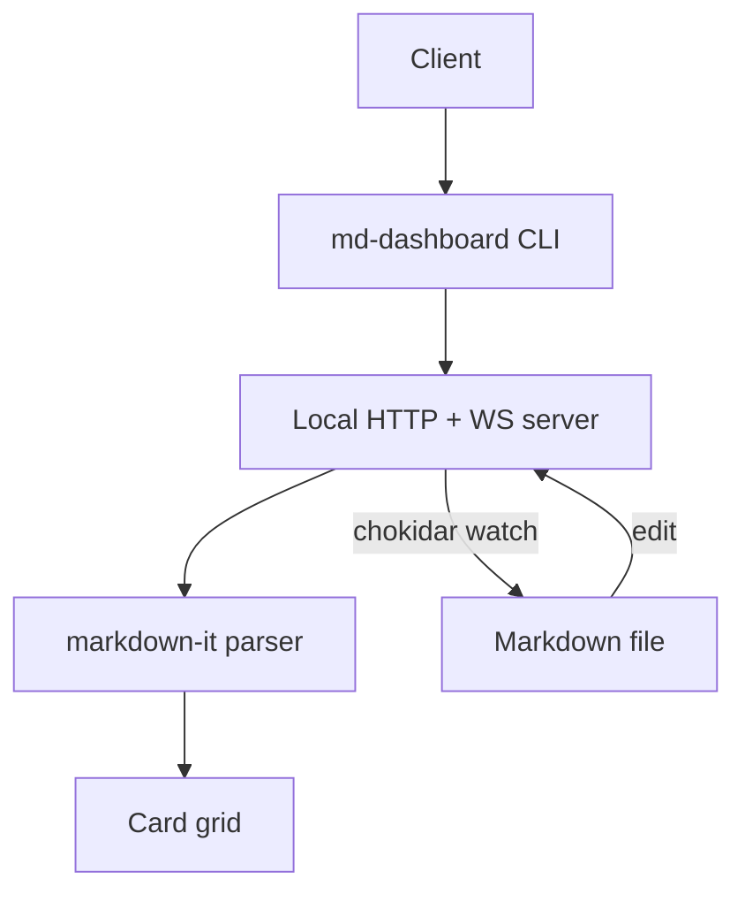

# Project Nova — Q3 Dashboard

## Overview

Project Nova is the team's **Q3 initiative** to ship the new onboarding flow.
This file is a normal Markdown doc — open it with `md-dashboard demo.md` and
every section below becomes a live, toggleable widget.

## Sprint Checklist

- [x] Define onboarding flow spec
- [x] Build signup form
- [x] Wire up email verification
- [ ] Add social login
- [ ] Ship to 10% rollout

## Release Metrics

| Month | Signups | Churn |
|---|---|---|
| Jan | 420 | 35 |
| Feb | 460 | 28 |
| Mar | 510 | 31 |
| Apr | 590 | 24 |

## Team Velocity

| Engineer | Points |
|---|---|
| Amara | 21 |
| Diego | 18 |
| Priya | 24 |
| Sam | 15 |

## Key Metrics

- Active users: 8420
- Monthly revenue: 15300
- Support tickets: 42

## Uptime

Metric: 99.95%

## System Architecture



## Weekly Active Users

```chart
{
  "type": "line",
  "categories": ["W1", "W2", "W3", "W4", "W5"],
  "series": [{ "label": "WAU", "data": [3100, 3400, 3650, 3900, 4200] }]
}
```

## Release Notes

> Ship early, ship often — every merge to `main` deploys to staging
> automatically.

```
$ md-dashboard demo.md
Serving demo.md at http://localhost:4321
```

## Preview


---

Built with **md-dashboard** — a read-only, live-updating view of this file.
