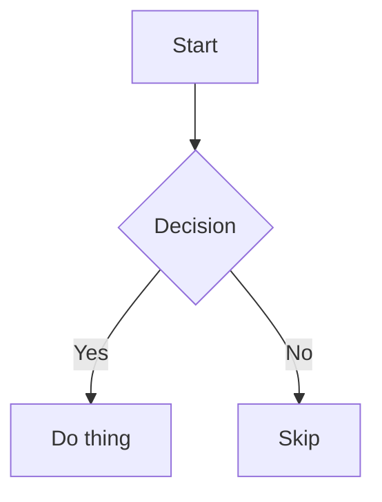

# Diagram & Chart Fixtures

## Flowchart



## Explicit Chart

```chart
{
  "type": "bar",
  "categories": ["Q1", "Q2", "Q3"],
  "series": [{ "label": "Revenue", "data": [10, 20, 15] }]
}
```

## Broken Diagram

```mermaid
this is not valid mermaid syntax !!!
```

## Notes

Just prose, no fence here.
